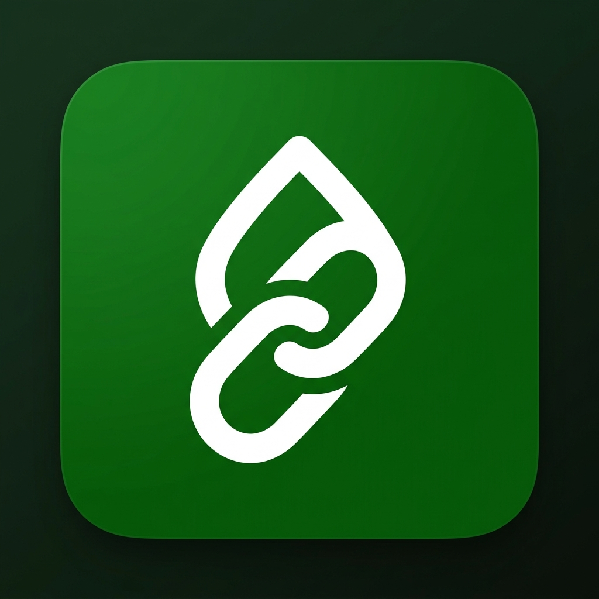

# 🔗 LinkDrop

> **Your personal link inbox.** Save any link from any app using your phone's native Share button. Search, browse by category, and never lose a link again.



---

## ✨ Features

| Feature | Description |
|---|---|
| **Web Share Target** | Appears in Android's native share sheet — just like WhatsApp or Notes |
| **Instant Save** | URL auto-filled from share; just add a title, pick a category, tap Save |
| **7 Categories** | Education · CS & AI · Games · Extracurricular · News · Entertainment · Other |
| **Real-time Search** | Search across title, URL, and notes instantly |
| **Category Filter** | Tap a pill to filter by category |
| **Stats Bar** | See total links, links saved today, and breakdown by category |
| **Open / Copy / Delete** | Full link management via card dropdown |
| **Export / Import** | Backup and restore your collection as JSON |
| **Offline First** | Works with no internet after first visit |
| **Installable PWA** | Add to Home Screen on Android and iOS — no App Store needed |

---

## 📂 Project Structure

```
link drop/
├── index.html        # Full SPA — all 4 pages (Home, Add, Share-Target, Settings)
├── app.js            # All app logic: routing, storage, CRUD, search, filter
├── styles.css        # Design system: green theme, glassmorphism, animations
├── manifest.json     # PWA manifest with Web Share Target config
├── sw.js             # Service worker: offline caching, SPA routing
├── vercel.json       # Vercel deployment config (rewrites + headers)
├── netlify.toml      # Netlify deployment config (redirects + headers)
├── robots.txt        # SEO: search engine crawl rules
├── .gitignore        # Git ignore rules
└── icons/
    ├── icon-192.png  # PWA icon (192×192)
    └── icon-512.png  # PWA icon (512×512)
```

---

## 🚀 Deploy in 2 Minutes

### Option A — Vercel (Recommended)

1. Create a free account at [vercel.com](https://vercel.com)
2. Click **Add New Project** → **Import Git Repository** (or drag-and-drop the folder)
3. Leave all settings default — `vercel.json` handles everything
4. Click **Deploy**
5. Your app is live at `https://your-project.vercel.app` ✅

### Option B — Netlify

1. Create a free account at [netlify.com](https://netlify.com)
2. Drag the entire project folder onto the Netlify dashboard
3. `netlify.toml` handles all redirects and headers automatically
4. Click **Deploy site** ✅

### Option C — GitHub Pages

> **Note:** GitHub Pages doesn't support custom HTTP headers, so the Service Worker scope header must be set differently. Use Vercel/Netlify for full PWA support.

1. Push the folder to a GitHub repo
2. Go to **Settings → Pages → Deploy from branch → main / (root)**
3. Add a `404.html` that redirects to `index.html` for SPA routing (see below)

---

## 📱 Installing on Android (Full Share Sheet)

After deploying:

1. Open Chrome on Android → visit your deployed URL
2. Tap the **"Install App on Device"** button (Settings page) or the browser install banner
3. Tap **Install**
4. ✅ **LinkDrop now appears in your share sheet** — share any link from YouTube, Instagram, WhatsApp, Chrome, etc. directly to LinkDrop

---

## 🍎 Installing on iPhone / iOS

1. Open Safari → visit your deployed URL
2. Tap the **Share** button (box with arrow) → **Add to Home Screen**
3. Tap **Add**
4. ✅ App icon appears on your home screen
5. To share links: use **Share → Safari → Copy**, then open LinkDrop and paste — or use the **Add** button manually

> **Note:** iOS Safari does not support Web Share Target API as of iOS 17. The app works perfectly as a standalone save-and-browse tool on iOS.

---

## 🗂️ Data Model

Links are stored in `localStorage` under the key `linkdrop_links`:

```json
{
  "id": "abc123xyz",
  "url": "https://youtube.com/watch?v=...",
  "title": "Python Full Course - 12 Hours",
  "category": "education",
  "note": "Watch this before the exam",
  "savedAt": 1715000000000
}
```

### Categories

| ID | Label |
|---|---|
| `education` | Education |
| `cs_ai` | CS & AI |
| `games` | Games |
| `extracurricular` | Extracurricular |
| `news` | News |
| `entertainment` | Entertainment |
| `other` | Other |

---

## 🔗 Web Share Target — How It Works

The magic is in `manifest.json`:

```json
"share_target": {
  "action": "/share-target",
  "method": "GET",
  "params": {
    "url": "url",
    "text": "text",
    "title": "title"
  }
}
```

When a user shares a link from **any app** on Android, the OS calls:
```
https://your-app.vercel.app/share-target?url=https://...&title=...
```

The app reads `?url=` from the query string and pre-fills the save form. The service worker intercepts this route and serves `index.html`, which then reads the query params and renders the Share page.

---

## 🛠️ Local Development

No build step needed — it's pure HTML/CSS/JS.

**Quickest way (Python):**
```bash
cd "link drop"
python -m http.server 3000
# Open http://localhost:3000
```

**With Node.js:**
```bash
npx serve .
# or
npx http-server . -p 3000
```

**With PowerShell (no extra tools):**
```powershell
# Run the built-in PowerShell HTTP listener (see dev-server.ps1)
```

> ⚠️ **Always serve via HTTP, not `file://`** — Service Workers and PWA features require an HTTP/HTTPS origin.

---

## 🔒 Privacy

- **All data stays on your device** — nothing is ever sent to a server
- `localStorage` is used for persistence; data is scoped to your browser
- No analytics, no tracking, no accounts
- Export your data anytime as JSON from the Settings page

---

## 🏗️ Tech Stack

| Layer | Choice | Reason |
|---|---|---|
| Framework | Vanilla HTML/CSS/JS | Zero build step, instant deploy, max compatibility |
| Styling | Custom CSS (glassmorphism design system) | Full control, no framework overhead |
| Fonts | Google Fonts (Inter + Material Symbols) | Premium look, free CDN |
| Storage | `localStorage` | No backend needed, works offline |
| PWA | `manifest.json` + Service Worker | Native installability, offline support |
| Share Target | Web Share Target API | Native share sheet integration on Android |
| Hosting | Vercel / Netlify (free tier) | Global CDN, HTTPS, custom domains |

---

## 📋 Roadmap / Future Ideas

- [ ] **Cloud sync** — back up links to a remote database (Supabase / Firebase)
- [ ] **Dark mode** — toggle between light and dark themes
- [ ] **Tags** — freeform tagging in addition to categories
- [ ] **Link preview** — fetch Open Graph metadata for richer cards
- [ ] **Collections** — group links into custom collections
- [ ] **Sorting** — sort by title, domain, or date added
- [ ] **Bulk actions** — select multiple links to delete or re-categorize
- [ ] **Browser extension** — save links directly from Chrome/Firefox desktop

---

## 📄 License

MIT — use it, fork it, ship it.

---

<p align="center">Built with ❤️ — a personal link inbox for the modern web</p>
